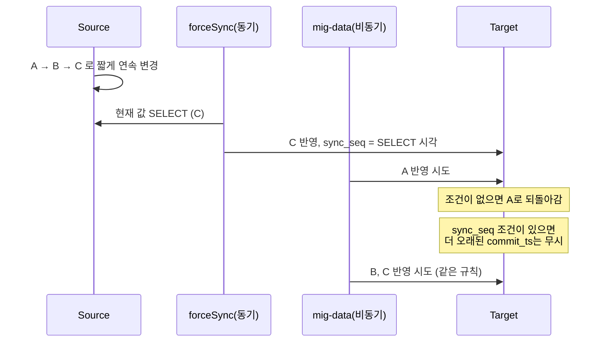

원문: [6개월 만에 연간 수십조를 처리하는 DB CDC 복제 도구 무중단/무장애 교체하기](https://d2.naver.com/helloworld/6388660) — NAVER D2, 조찬형·이영대·김동민, 2025-11-18

## 한 줄 요약

네이버페이 주문 DB의 변경을 판매자·정산·배송 DB 등으로 복사해 주는 도구를 7년 만에 새로 만들어 바꿨다. 새 도구(ergate)는 일을 복제·검증·복구 셋으로 나눴고, 빠른 것은 Flink에, 복잡한 것은 Spring에 뒀다. 전환은 옛 도구와 새 도구가 서로 모르는 채로 같은 데이터를 둘 다 복제하게 한 뒤, 검증부터 먼저 켜고, 테이블을 단계별로 옮기고, 옛 도구의 검증은 맨 마지막까지 남겼다. 결과는 무중단·무장애.

## 배경: 왜 바꾸는가

주문 DB는 구매자 기준으로 나뉘어([샤딩](/posts/partitioning-and-sharding/)) 있다. 판매자 화면은 판매자 기준으로 봐야 하므로 판매자 기준으로 다시 나눈 DB가 따로 있고, 정산·배송·호스팅사·옛 Oracle 조회 앱용 DB도 있다. 주문 DB의 변경을 이들에게 실시간으로 복사해 주는 것이 CDC 복제 도구다. [CDC](/posts/cdc-principles-and-limits/)(Change Data Capture)는 DB가 남기는 변경 기록(MySQL의 binlog)을 읽어 "무엇이 바뀌었다"를 이벤트로 만드는 기법이고, 여기서는 사내 도구가 그것을 Kafka에 넣는다.

기존 도구(mig-data)는 DB 코어 경험이 있는 개발자가 순수 Java로 만든 것이라 백엔드 개발자가 넘겨받아 고치기 어려웠다. 그리고 예전에 양방향 복제를 지원하느라 생긴 제약이 남아 있었다. 한 건이 실패하면 전체가 밀리고(양방향 무결성 확인을 위한 의도된 동작), 컬럼을 추가할 때 Target → Source 순서를 지켜야 했고(순서가 틀리면 복제가 잠시 멈춤), 장애 시 복구할 수 있는 사람이 제한적이었다.

목표: 백엔드 개발자가 유지보수할 수 있을 것, 스키마 변경 순서에 무관할 것, 복구 도구를 다양하게 갖출 것, 현재 QPS의 10배를 처리할 것, CDC 이벤트 발행 후 1초 안에 복제할 것.

## 구조: 빠른 것은 Flink, 복잡한 것은 Spring

Flink를 고른 이유는 저지연·대용량·고가용성을 프레임워크가 해 줘서 복제 로직에 집중할 수 있고, Kafka 연동이 쉽고, 알리바바 같은 커머스 사례가 있어서다. Kubernetes 위에 세션 모드(공용 클러스터에 job을 제출하는 방식)로 띄웠다. 복제 job 6개와 검증 job 6개, 총 12개를 한 화면에서 보고 한 번에 배포하려면 세션 모드가 맞았다.

그런데 Flink job 안에 모든 것을 넣으니 불편했다. 그래서 Flink에는 속도가 중요한 로직만 두고, 복잡한 복구 로직은 Spring 모듈로 뗐다. 스키마 정보도 Spring이 DB에서 읽어 객체로 만들고, Flink는 HTTP로 가져와 캐시한다. Flink는 병렬도가 높아 DB 커넥션을 나눠 쓰기 어렵고, 그래서 DB보다 상대적으로 저렴한 HTTP를 썼다.

세 기능은 이렇다.

- 복제(jdbc-sink): Kafka 레코드를 읽어 Target에 반영한다. 복제 시각과 원본 커밋 시각을 담는 전용 컬럼 둘을 같이 쓴다.
- 검증(verifier): 같은 토픽을 2분 늦게 읽어 Kafka 레코드와 Target의 현재 값을 비교한다. 2분 사이에 그 행이 또 바뀌었으면 무조건 불일치로 보이므로, 1차 불일치면 Source의 현재 값을 다시 조회해 재비교한다. 그래도 불일치면 DLQ(실패 큐)로 보내고 Spring이 상태 DB에 적는다.
- 복구(Spring): 검증 실패 건을 복구 시점에 재조회해 다시 검증하고, 정말 다르면 Target을 고친다. 순단이면 5분 뒤 자동 복구, 그래도 안 되면 배치로 재시도, 어드민 페이지로 수동 복구. 복구 뒤 30분 지나 다시 확인하고 상태 DB에서 지운다.

## 개선 1: 컬럼 추가 순서에서 자유로워지기

기존 제약의 핵심은 Target이 모르는 컬럼 데이터가 들어오면 처리하지 못한다는 것이었다. 원문은 여기서 한 가지를 관찰한다. DDL(컬럼 추가)은 운영 영향을 줄이려고 보통 새벽에 하고, 그 컬럼에 실제 데이터가 들어오는 것은 별도 코드 배포 뒤다. 즉 DDL 시점과 데이터 인입 시점은 다르다. 그러면 복제 도구가 스키마를 캐시해 두고, 복제 시점에 캐시된 컬럼만 쓰면 된다. Source에 먼저 컬럼이 생기면 Target 쪽 statement가 모르니 무시했다가 갱신 뒤 반영되고, Target에 먼저 생기면 데이터가 없으니 null이다. 어느 순서든 멈추지 않는다. 예외는 컬럼 삭제다. 캐시된 statement가 없는 컬럼을 쓰면 오류가 나므로, 삭제 전에 `ignore-columns` 설정을 미리 넣어 둔다.

## 개선 2: 실패해도 멈추지 않는다

복제 단계에서 한 건이 실패하면 무시하고 다음을 계속 복제한다. 실패 건은 검증이 잡아서 복구로 넘긴다. 잘못 잡힐 수 있으므로 복구 단계에서 다시 검증한다. Oracle은 읽기 전용 복제본에서 검증하는데 마스터와 복제본 차이로 오검출될 수 있어 복구 시 마스터에서 재조회하고, 판매자 DB는 샤딩 키 조회가 순단으로 실패할 수 있어 재조회한다. 나는 이것을 "실패를 막는다"에서 "실패를 뒤에서 찾아 고친다"로 설계 원칙을 바꾼 것으로 읽는다.

## 성능: 200ms를 40ms로

목표는 10배 QPS. 테스트 환경을 따로 만들고(같은 스키마의 논리 DB, 전용 CDC, fixture-monkey 기반 데이터 생성기 banana) 쟀더니 한 건이 Source 커밋부터 Target 커밋까지 200ms 걸렸다. 병렬도를 올리면 되지만 "DB 커넥션은 비싸다, Flink slot도 한정적이다"를 전제로 원인을 찾았다. flame graph를 켜고 하나씩 잡았다.

| 원인 | 조치 | 결과 |
| --- | --- | ---: |
| task 간 객체 직렬화 | object reuse 옵션(같은 task manager 안에서는 직렬화 생략) | 200 → 130ms |
| 데이터 쏠림 | Kafka 키(구매자 번호)를 그대로 Flink 키로 써서 파티션 쏠림이 slot까지 이어짐 → 구매자 번호 + 테이블명으로 키 구성 | 130 → 70ms |
| DB I/O 횟수 | JdbcSink 확장: 고정 배치 크기 대신 TCP 혼잡 제어처럼 50~100ms에 할당량을 채우면 유지, 넘으면 줄이고, 못 채우면 늘리는 동적 배치 | 70 → 40ms |
| 네트워크 버퍼 | 버퍼 타임아웃 0으로 처리량 대신 지연 우선 | 소폭 개선 |
| 검증 | 순서가 중요하지 않으므로 비동기로 | 병렬도 낮춰도 충분 |

## 장애 테스트에서 나온 서킷 브레이커

Flink job manager·task manager·Spring 모듈을 각각 죽여 기대 동작을 확인했다. DB는 공용 개발 장비라 진짜 내릴 수 없어서, DB 커넥션 클래스를 확장해 피처 토글이 켜지면 3초 자다 예외를 던지는 `BoomableConnection`을 만들어 모의 장애를 냈다.

Target DB 장애에서 예상 못 한 일이 났다. 검증이 Target 행을 읽으려고 새 커넥션을 계속 시도하다 대기 시간이 쌓여 Flink 자체가 죽었다. Source 장애에서는 안 났는데, Source는 불일치일 때만 선택적으로 읽기 때문이다. 해법은 검증에 [서킷 브레이커](/posts/circuit-braker/)를 넣는 것이었다. DB 오류가 5회 연속이면 서킷을 열고, 열린 동안은 검증하지 않고 바로 DLQ로 보낸다. 원문에 그 구현 코드가 있다.

## 전환: 서로 모르는 두 도구

원문은 옛 도구에 중복 방어 로직(예를 들어 "새 도구가 복제했으면 건너뛰기")을 넣지 않았다. 옛 도구의 동작에 어떤 영향을 줄지 모르고, 운영에서 문제가 나면 위험이 크기 때문이다. 대신 둘이 각자 복제한다. 같은 행을 두 번 쓰니 일시적으로 과거 값으로 돌아갈 수 있지만, 충분히 빨라 사용자는 인지할 수 없고 최종적으로 일치한다고 판단했다.

과거 회귀는 이미 기존 구조에 있던 문제였다. 옛 도구(비동기) 옆에 API로 즉시 복제하는 forceSync(동기)가 있었고, 짧은 시간에 A→B→C로 바뀌면 forceSync가 C를 먼저 쓰고 옛 도구가 A→B→C를 다시 써서 잠깐 과거로 갔다. 해법은 "복제 반영 시점" 컬럼을 두고 `WHERE :commit_ts >= sync_seq` 조건으로 더 오래된 커밋은 무시하는 것이다. 새 도구도 같은 논리로 `rpc_time` 컬럼을 썼다.

원문이 설명한 이 엇갈림을 순서대로 그리면 다음과 같다. forceSync가 쓰는 값은 Source SELECT 시점의 시간이다.

배포 순서에도 이유가 있다. 검증을 제일 먼저 배포한다. 검증은 데이터를 건드리지 않고, 자동 복구를 안 켜 두면 검출돼도 문제가 없으므로 오검출·과검출을 미리 볼 수 있다. 그리고 옛 도구의 검증은 맨 마지막까지 남긴다. 정상일 때는 검출이 없어 새 검증이 맞는지 알 수 없으니, 옛 검증이 정답지 역할을 한다. 테이블은 영향도 낮은 것부터 1차 5개, 2차 13개, 3차 나머지로 나눠, 각 차수마다 1주일 동시 복제 → 옛 도구 중단 → 새 도구 단독을 반복했다.

## 트러블슈팅 둘

- job manager Metaspace OOM(클래스 메타데이터 영역의 메모리 부족). 세션 모드에서는 job/task manager를 띄우는 Parent 클래스로더와 사용자 코드를 읽는 Child 클래스로더가 나뉘고, job이 끝나면 Child가 사라지며 자원을 놓는다. 그런데 사용자 코드의 클래스를 Parent 쪽 어딘가(예: Jackson ObjectMapper의 static Map)가 참조하면 Child가 못 사라진다. 배포를 반복하면 쌓여 OOM이 난다. Flink 문서도 세션에 제출된 job의 클래스는 `FlinkUserCodeClassLoader`가 동적으로 읽고, 클래스가 언로드되지 않으면 로드된 클래스 수가 누적돼 보통 `OutOfMemoryError: Metaspace`로 나타난다고 설명한다([Debugging Classloading](https://nightlies.apache.org/flink/flink-docs-stable/docs/ops/debugging/debugging_classloading/)). 원인은 "Parent에 없는 사용자 클래스가 static 필드 타입으로 정의된 경우"였다. DB 드라이버 같은 것은 fat JAR로 클러스터에 미리 넣고, 사용자 코드에서 static 리소스를 피하고, ArchUnit 테스트로 재발을 막았다.
- job manager split brain(리더가 둘이 되는 상태). Kubernetes HA에서 리더의 네트워크가 잠깐 끊긴 찰나에 팔로워가 리더를 가져갔는데 옛 리더가 내려오지 않아 둘이 됐다. 재배포 시 빠른 교체를 위해 lease-duration과 renew-deadline을 둘 다 5초로 뒀던 것이 원인이었다. 둘이 같으면 이 문제가 생길 수 있다. 30초·20초·6초로 바꾸자 사라졌다.

## 결과

1월 말에 시작했고, 시작 당시 두 명이 기존 업무를 겸해 본격 착수는 3월, 3명이 된 것은 5월이다. 1차 목표인 판매자 DB 전환을 7월에 끝냈고 처음 세운 목표를 모두 달성했다. 잠깐의 해프닝은 있었지만 서비스 영향은 거의 없었고, 데이터 사고와 사용자 문의는 없었다. forceSync는 새 도구만으로 충분히 빨라 비활성화했고 내리는 중이다. 결정 과정은 ADR로 남겼다.

## 읽고 남는 질문

- "서로 모르는 두 도구가 같은 행을 쓴다"는 전략은 `>=` 조건 덕에 안전하지만, 옛 도구와 새 도구가 같은 밀리초에 다른 값을 쓰면(ms를 절삭해 발행하므로) 어느 쪽이 남는지 정해지지 않는다. 원문도 `>`가 아니라 `>=`인 이유를 ms 절삭 때문이라고 적었는데, 그 창에서 실제 불일치가 몇 건 검출됐는지 궁금하다.
- 검증의 2분 지연은 어떻게 정했는지. 너무 짧으면 오검출이 늘고 너무 길면 장애 발견이 늦어지는데, 그 사이의 값을 고른 근거가 있으면 좋겠다.
- 동적 배치 크기가 TCP 혼잡 제어를 닮았다고 했는데, 트래픽이 급감할 때 할당량이 너무 작아져 지연이 늘지 않는지, 하한이 있는지가 없다.

## 한 줄로 가져가기

복제 도구의 안전은 "복제가 틀리지 않게"가 아니라 "틀린 것을 검증이 찾고 복구가 고치게" 셋으로 나누는 데서 나오고, 도구 교체의 안전은 옛것과 새것이 서로를 모른 채 같이 돌게 두고 검증을 먼저 켜는 데서 나온다.

## 참고

- [6개월 만에 연간 수십조를 처리하는 DB CDC 복제 도구 무중단/무장애 교체하기](https://d2.naver.com/helloworld/6388660) — NAVER D2, 2025-11-18
- [Debugging Classloading](https://nightlies.apache.org/flink/flink-docs-stable/docs/ops/debugging/debugging_classloading/) — Apache Flink 공식 문서
