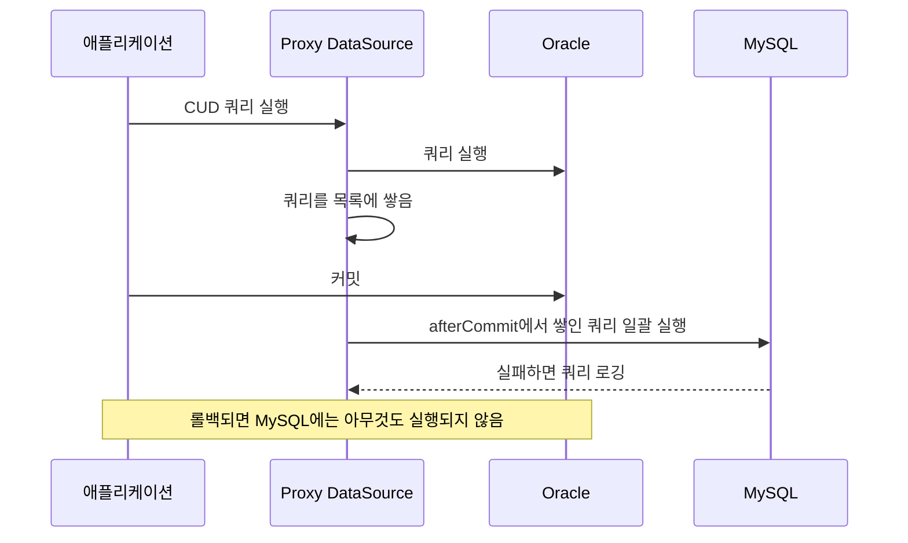

원문: [스마트스토어센터 Oracle에서 MySQL로의 무중단 전환기](https://d2.naver.com/helloworld/6512234) — NAVER D2, 조호영·김지한, 2026-01-22

## 한 줄 요약

10년 넘은 서비스의 데이터베이스를 Oracle에서 MySQL로 바꾸는데, 서비스를 멈출 수 없고 문제가 나면 바로 되돌릴 수 있어야 했다. 원문이 택한 답은 이중 쓰기다. 쓰기를 두 DB에 동시에 하되 새 DB 쪽 실패는 무시하고, 실제 읽기 요청을 복제해 새 DB의 성능을 미리 재고, 6개월 동안 두 DB의 데이터를 대조해 불일치를 하나씩 없앤 뒤에야 읽기를 옮겼다. 옮기고 나서도 Oracle 방향으로 이중 쓰기를 계속해 언제든 롤백할 수 있게 뒀다.

## 왜 옮기는가

스마트스토어의 여러 파트가 Oracle을 같이 쓰고 있었다. 비즈니스가 커지자 서로 자원을 뺏어 성능이 불안정해졌고, Oracle을 늘리면 라이선스 비용이 크게 뛴다. 그래서 회원 파트가 자기 몫을 MySQL로 떼어 내기로 했다. 조건은 둘이다. 회원 모듈이 다른 부서 시스템과 넓게 연결돼 있어 서비스를 멈출 수 없었다. 그리고 DB 전환 뒤 치명적 성능 저하가 나면 재배포로는 못 고치므로 빠르게 롤백할 수 있어야 했다.

## 핵심 아이디어: 두 곳에 쓰고, 한 곳에서 읽는다

전환은 세 단계다.

1. 전환 전: 옛 애플리케이션이 읽기·쓰기를 전부 Oracle에서 하되, 쓰기(등록·수정·삭제)가 일어날 때마다 뒤에서 MySQL에도 같이 쓴다.
2. 데이터 이관: 새 애플리케이션을 배포하기 전에 Oracle 전체 데이터를 MySQL로 옮겨 맞춘다.
3. 전환 후: 새 애플리케이션이 읽기·쓰기를 MySQL에서 하고, 뒤에서 Oracle에도 같이 쓴다.

3단계에서도 Oracle에 계속 쓰기 때문에, 문제가 생기면 데이터 복구 없이 옛 애플리케이션으로 되돌리면 된다. 이것이 롤백 능력이다.

## 자세히 보기 1: 새 DB 쪽 실패는 트랜잭션을 깨지 않는다

내가 보기에 이중 쓰기에서 가장 중요한 결정이 여기 있다. 한 트랜잭션 안에서 쿼리 여럿을 실행하다 오류가 나면 두 DB의 정합성은 어떻게 되는가.

원문은 MySQL 쿼리를 **트랜잭션에 포함시키지 않기로** 했다. 두 DB를 한 트랜잭션으로 묶는 도구(ChainedTransactionManager, 분산 트랜잭션)가 있지만, 원문은 쓰면 안 되는 이유를 셋 든다. 이중 쓰기를 시작하는 시점에는 두 DB의 데이터가 아직 안 맞고, 모든 쿼리가 MySQL에서 오류 없이 도는지 검증되지 않았고, 인덱스·[커넥션 풀](/posts/connection-pool/) 설정도 최적화되지 않은 상태다. 그래서 읽기 전환 전까지는 MySQL 쪽만 실패하는 일이 여러 이유로 생길 수 있다. 원문은 그 실패로 트랜잭션이 롤백되면 안 되고 무시되어야 한다고 본다.

그래서 트랜잭션 도중 실행된 쿼리를 모아 두었다가 커밋 후 한꺼번에 MySQL에서 실행한다. 롤백되면 MySQL에는 아무것도 실행되지 않았으니 신경 쓸 것이 없고, Oracle 커넥션을 붙잡는 시간도 늘지 않는다. MySQL 쪽 실패는 용인하고, 주기적 검증으로 불일치 원인을 찾아 없애는 방식이다. 구현은 Spring의 `TransactionSynchronizationManager`에 동기화 콜백을 등록해 커밋 시점에 끼어든다. `TransactionSynchronization.afterCommit()`의 Javadoc 첫 문장은 "Invoked after transaction commit."(트랜잭션 커밋 후에 호출된다)이다([Spring Javadoc](https://docs.spring.io/spring-framework/docs/current/javadoc-api/org/springframework/transaction/support/TransactionSynchronization.html)).

아래는 원문의 예제 코드와 설명을 순서로 다시 그린 것이다.

## 자세히 보기 2: 비즈니스 코드를 한 줄도 안 고치고 두 곳에 쓰기

서비스는 JPA와 MyBatis를 같이 쓴다. [JPA](/posts/jpa-architecture/) 쪽은 실행되는 SQL을 가로채는 라이브러리([datasource-proxy](https://jdbc-observations.github.io/datasource-proxy/docs/current/user-guide/))로 Oracle에서 실행된 쿼리를 그대로 MySQL에도 흘려보냈다. 단순 CUD라 두 DB의 문법 차이가 거의 없어 가능했다.

MyBatis 쪽이 어려웠다. 쓰기 로직마다 "MySQL 매퍼도 호출"을 넣으려면 10년치 비즈니스 코드 수백, 수천 곳을 고쳐야 한다. 그래서 MyBatis의 내부 구조를 이용했다. `@Mapper` 인터페이스 호출은 결국 `SqlSession`의 메서드 호출로 끝나므로, `SqlSession`을 만들어 주는 팩토리를 감싸서 하나의 세션이 Oracle과 MySQL 두 세션을 들고 있다가 CUD면 양쪽에 실행하게 만들었다(`CombinedSqlSessionFactory`). 읽기는 Oracle 결과만 쓴다. 이렇게 하면 이중 쓰기 로직이 한 곳에 모이고, 전환이 끝나면 그 한 곳만 지우면 된다. 대신 MyBatis XML은 MySQL 문법(`SYSDATE`→`NOW()`, `NVL`→`IFNULL`, `ROWNUM`→`LIMIT`)으로 한 벌을 더 써야 했다.

## 자세히 보기 3: 성능은 실제 읽기 요청을 복제해서 쟀다

쓰기는 이중 쓰기로 실제 부하가 MySQL에 가지만, 읽기는 안 간다. 그런데 Oracle에서 잘 돌던 복잡한 쿼리가 MySQL에서 똑같이 빠른지는 실제 부하로 확인해야 한다. HTTP 트래픽 복사나 Kafka 토픽 복제로 운영 부하를 재현하면 비즈니스 로직이 다시 돌아 다른 부서 시스템까지 중복 호출되므로 부작용 위험이 크다.

그래서 원문은 Repository 계층에서 읽기만 복제했다. 나는 이 방법이 깔끔하다고 본다. Repository 계층의 읽기 메서드가 호출될 때 **메서드 이름과 인자를 JSON으로 캡처해 Kafka로** 보내고, 별도 소비자가 그것을 받아 [리플렉션](/posts/class-loading-and-startup/)으로 MySQL을 바라보는 같은 Repository 메서드를 호출한다. 비즈니스 로직은 거치지 않고 DB 조회만 재현된다. 메시지마다 Oracle에서의 실행 시간도 실려 있어 쿼리별로 MySQL과 비교할 수 있었고, 느린 쿼리를 고치고 인덱스를 추가했다.

## 자세히 보기 4: 정합성은 6개월 동안 대조했다

이중 쓰기 로직에 문제가 있어 데이터가 다르게 쓰이고 있지 않은지는 정량적으로 확인해야 한다. Airflow로 주기적으로 두 DB의 주요 테이블을 Hive에 모아 레코드 수, 핵심 컬럼의 해시, 비즈니스 통계값을 비교했다. 추출 시각 차이로 생기는 불일치는 손으로 걸렀다. 테이블별 불일치 건수 리포트를 보며 로직을 고치기를 약 6개월 반복해 정합성을 맞췄다. 그 뒤 약 3개월의 QA를 거쳤다. 전환이 끝났는지는 모든 대상 쿼리에 미리 붙여 둔 주석(`회원개발쿼리`)이 Oracle에 더 이상 들어오지 않는 것으로 확인했다.

## 트러블슈팅 셋

- **Index Merge**: MySQL은 WHERE에 인덱스 컬럼이 OR로 묶이면 각 인덱스를 따로 찾아 합치는데([MySQL 8.0 Reference Manual](https://dev.mysql.com/doc/refman/8.0/en/index-merge-optimization.html)), 원문에 따르면 nesting OR 등 조건이 조금만 복잡해지면 최적화하지 못하고 풀스캔한다. Oracle에서 빠르던 쿼리가 MySQL에서 풀스캔이 됐고, UNION으로 쪼개 해결했다.
- **이관 배치의 페이징**: Oracle에서 읽는 Spring Batch `JdbcPagingItemReader`에 `OraclePagingQueryProvider`를 쓰면, PK가 하나일 때는 옵티마이저가 최적화해 주기도 한다. 그런데 PK가 둘이면 "정렬 + OR 조건" 때문에 인덱스 시작 지점을 특정할 수 없어 거의 항상 전체 정렬이 일어난다. 두 번의 Top-N 조회를 UNION ALL로 합치는 쿼리를 만드는 커스텀 QueryProvider로 풀었다.
- **시퀀스 vs auto increment**: Oracle 시퀀스는 INSERT 전에 ID가 나오지만 MySQL auto increment는 INSERT 후에 나온다. JPA에서 `persist()` 직후 ID를 쓰던 연관관계 저장 로직이 깨져서 flush 시점과 저장 순서를 고쳤고, 못 고치는 곳은 채번 테이블을 따로 뒀다. 같은 차이는 역방향 이중 쓰기에도 걸린다. MySQL INSERT 쿼리에는 PK가 없으므로, 읽기 전환 후 Oracle로 쓸 때는 generated key를 받아 PK를 채운 쿼리로 바꿔야 한다. 원문은 이 대목에서 UUID v7이나 Snowflake처럼 DB에 의존하지 않는 방식으로 PK를 만들었다면 이런 고민은 필요 없다고 적는다.

[HikariCP](/posts/hikaricp/) 위키의 MySQL 권장 설정(`cachePrepStmts`, `useServerPrepStmts`, `rewriteBatchedStatements` 등)도 정리돼 있다. 원문에 따르면 `rewriteBatchedStatements`는 배치 INSERT를 한 문장으로 묶어 보내 대량 삽입에서 수십 배 차이가 날 수 있다.

## 결과

Oracle 세션 수와 PGA 메모리 사용량이 줄어 공용 장비를 쓰는 다른 부서에 여유가 생겼고, 회원 파트는 별도 장비에서 파드를 늘릴 수 있게 됐다. 성능 모니터링 중 튜닝한 쿼리 덕에 API 지연도 개선됐다.

## 읽고 남는 질문

- 커밋 후 MySQL에 쓰는 방식은 "Oracle 커밋은 됐는데 MySQL 쓰기 전에 프로세스가 죽는" 창이 있다. 그 창에서 생긴 불일치가 6개월 리포트에 얼마나 잡혔는지, 그것을 어떻게 메웠는지가 궁금하다.
- 읽기 복제는 Repository 메서드 단위라, 한 트랜잭션 안에서 여러 조회가 순서대로 일어나는 패턴(앞 조회 결과로 뒤 조회)은 재현되지 않는다. 성능 검증에서 빠진 부분이 있었는지.
- 이중 쓰기 코드를 제거한 시점과 그 뒤 Oracle을 완전히 끊은 시점은 언제였는지. 롤백 창을 얼마나 오래 열어 두는 것이 적당한지에 대한 판단이 있으면 좋겠다.

## 한 줄로 가져가기

무중단 DB 전환의 뼈대는 "두 곳에 쓰고 한 곳에서 읽는다"이지만, 실제로 일을 되게 한 것은 새 DB 실패를 트랜잭션에서 떼어낸 결정, 비즈니스 코드를 안 건드린 가로채기, 그리고 6개월간의 대조였다.

## 참고

- [스마트스토어센터 Oracle에서 MySQL로의 무중단 전환기](https://d2.naver.com/helloworld/6512234) — NAVER D2 원문
- [TransactionSynchronization](https://docs.spring.io/spring-framework/docs/current/javadoc-api/org/springframework/transaction/support/TransactionSynchronization.html) — Spring Framework Javadoc
- [Index Merge Optimization](https://dev.mysql.com/doc/refman/8.0/en/index-merge-optimization.html) — MySQL 8.0 Reference Manual
