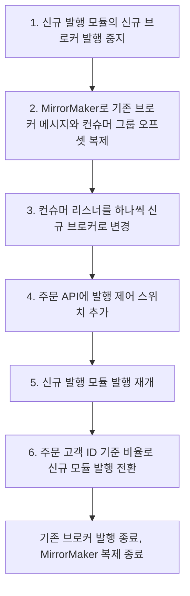

원문: [일 3,000만 건의 네이버페이 주문 메시지를 처리하는 Kafka 시스템의 무중단 전환 사례](https://d2.naver.com/helloworld/9581727) — NAVER D2, 김태성(Platform Labs), 2024-03-07

이 글을 고른 이유는 [MCP의 Shadow Release](/posts/shadow-release-query-migration/)와 같은 문제를 다른 규모에서 풀었기 때문이다. 나는 MyBatis 조회를 QueryDSL로 옮기며 두 결과를 나란히 비교했다. 원문은 하루 3,000만 건의 Kafka 메시지를 만드는 모듈과 브로커를 바꾸며 두 메시지를 나란히 비교했다. 비교 대상이 조회 결과에서 메시지로 바뀌면 무엇이 달라지는지 보고 싶었다.

## 원문이 말하는 것

네이버페이 주문 메시지는 결제 완료, 발송, 배송 완료, 구매 확정 같은 주문 액션마다 주문 정보 전체(500개 이상의 필드)를 담아 연관 시스템에 전파된다. 기존 구조는 [트랜잭셔널 아웃박스](/posts/parity-pay-outbox/)였다. 주문 API가 DB 트랜잭션 안에 주문 번호와 액션 타입 같은 최소 키만 아웃박스 테이블에 적고, 별도 폴링 배치가 그 키로 데이터를 조합해 메시지를 만들어 발행한다.

주문량이 늘자 세 문제가 생겼다. 공용 Kafka에서 다른 토픽과 자원 경쟁, 발행 요청이 많아지며 발행 지연, 그리고 지연 때문에 메시지가 발행 당시가 아니라 변경된 최신 상태를 담는 문제다. 발행이 늦으면 사용자에게 결제 내역이 안 보이고 정산이 밀린다. 재설계는 둘이다. 주문 메시지 전용 Kafka 클러스터, 그리고 자체 개발한 [CDC](/posts/cdc-principles-and-limits/)로 아웃박스 구현을 폴링에서 트랜잭션 로그 테일링으로 바꾸는 것이다. 이 패턴을 정리한 Chris Richardson은 해법을 "Tail the database transaction log and publish each message/event inserted into the _outbox_ to the message broker."(DB 트랜잭션 로그를 따라 읽으며 아웃박스에 들어온 메시지를 브로커로 발행한다)라고 적는다([microservices.io](https://microservices.io/patterns/data/transaction-log-tailing.html)).

발행 모듈을 새로 만들었으므로 신뢰성을 검증해야 했다. 원문은 "신뢰성"을 기존 메시지와 동일한가로 정의하고, 이상 케이스를 넷으로 나눈다. 스펙이 다름, 발행 누락, 중복 발행, 의도하지 않은 발행. 앞의 하나는 "약속된 스펙이 보장되는가", 뒤의 셋은 "약속된 메시지만 발행되는가"다. 그래서 검증기도 둘이다.

- **정합성 검증기**: 기존 메시지를 소비해 키를 뽑고, 신규 모듈의 생성 로직으로 검증용 메시지를 만들어 필드를 비교한다. 생성 시점에 따라 달라지는 필드는 민감도를 조절한다.
- **발행 검증기**: 기존·신규 메시지 양쪽의 키를 저장소에 적고, 배치가 양쪽이 같은 메시지를 발행했는지 대조한다.

검증기가 실제로 잡은 것은 누락된 필드, 다른 값으로 생성된 필드, 암호화되지 않은 필드, 그리고 작업 도중 기존 시스템에 추가된 신규 스펙이었다.

전환은 브로커가 바뀌므로 어렵다. 컨슈머가 브로커 주소만 바꾸면 [컨슈머 그룹](/posts/kafka-consumer-group-rebalance/) 오프셋이 초기화되어 누락이나 중복이 난다. [멱등하지 않은 컨슈머](/posts/kafka-delivery-guarantees/)가 많아 "earliest부터 중복 허용"은 안 되고, 많은 컨슈머가 동시에 작업해야 하고 실시간 처리가 중요한 컨슈머도 있어 "전부 멈추고 한 번에"도 안 된다. 그래서 택한 것이 MirrorMaker 복제를 이용한 점진 전환이다. 기존 브로커의 메시지를 컨슈머 그룹 오프셋까지 신규 브로커로 복제하고, 컨슈머를 하나씩 옮긴다. Kafka 문서도 MirrorMaker의 기능으로 클러스터 간 애플리케이션 이전을 위해 컨슈머 그룹과 오프셋을 복제하는 것을 든다([Kafka 3.9 docs, Geo-Replication](https://github.com/apache/kafka/blob/3.9.0/docs/ops.html)). 주의점은 셋이다. 같은 그룹 ID를 써야 오프셋을 승계한다. 전환 중 양쪽을 동시에 소비하면 오프셋이 꼬여 중복 소비가 난다(Blue-Green 배포 주의). 오프셋 동기화는 실시간이 아니라 주기적이므로, interval 설정값에 맞춰 전환 중 중단 시간을 조절해야 한다(최소 interval 1초). 3주에 걸쳐 30여 개 컨슈머를 옮겼다.

원문의 전환 단계는 여섯이다. 아래는 원문이 설계한 순서를 그대로 옮긴 것이다.

컨슈머가 다 옮겨간 뒤 발행 모듈을 교체한다. 주문 API에 발행 제어 스위치를 두고 주문 고객 ID를 키로 비율을 올려 가며 신규 모듈로 넘긴다. 내가 보기에 원문의 마지막 주의가 이 글에서 가장 중요한 문장이다. 발행 제어 키와 Kafka 파티션 키가 다르면 기존·신규 모듈이 같은 파티션에 메시지를 섞어 넣고, MirrorMaker 복제 시간에 따라 순서가 깨진다.

## 같은 곳: 신구를 나란히 놓는 것

MCP의 Shadow Release는 기존 조회와 신규 조회를 같은 요청에 대해 둘 다 실행하고 결과를 비교해 불일치를 로그로 남기는 방식이었다. 원문의 정합성 검증기가 같은 방식이다. 기존 메시지를 입력으로 신규 로직을 돌려 비교한다. "생성 시점에 따라 달라지는 필드는 민감도를 조절한다"는 것도 같다. 나는 정렬 순서와 NULL 처리 차이를 불일치에서 제외해야 했다.

다른 것은 검증기가 둘이라는 점이다. 조회에는 "결과가 같은가"만 있지만, 메시지에는 "내용이 같은가"와 별개로 **"발행됐어야 할 것이 발행됐는가"**가 있다. 누락·중복·의도치 않은 발행은 내용 비교로는 잡히지 않는다. 그래서 키만 따로 저장해 집합을 대조하는 두 번째 검증기가 필요하다. [parity-pay 8편](/posts/parity-pay-kafka-failures/)에서 `acks` 실험을 하며 "PUBLISHED로 표시됐는데 브로커에 없음"을 찾은 방법이 이것이다. DB의 PUBLISHED 집합과 브로커에서 읽은 eventId 집합을 대조했다. 원문은 그것을 운영 환경에서 실시간으로 돌렸다.

## 같은 곳: 발행 제어 키 = 파티션 키

원문이 마지막에 적은 주의는 내가 두 저장소에서 각각 다른 모양으로 만난 것이다. [monticker 24편](/posts/monticker-partition-ordering/)에서 키는 종목 ID로 맞았는데 프로듀서가 acks=0이라 같은 파티션 안에서 배치가 뒤바뀌었다. [parity-pay 8편](/posts/parity-pay-kafka-failures/)에서 키를 랜덤으로 두자 결제의 1/3이 뒤집혀 3,600원씩 과지급됐다. 원문의 경우는 세 번째 모양이다. 키는 맞는데 **발행 주체가 둘**이라, 같은 키의 메시지가 두 모듈에서 나오고 그중 하나는 MirrorMaker를 거쳐 늦게 도착한다. 순서 보장은 키·acks·컨슈머 스레드 모델의 곱이라고 24편에 적었는데, 원문은 거기에 "발행 경로가 하나일 것"을 더한다. 전환 기간에는 발행 경로가 둘이므로, 같은 키의 메시지가 반드시 같은 경로로 나가게 제어 키를 파티션 키와 일치시켜야 한다.

## 원문이 답하지 않는 것

첫째, 검증기가 찾은 불일치의 건수다. 종류(누락 필드, 다른 값, 암호화 누락, 신규 스펙)는 있지만 몇 건 중 몇 건이었는지, 검증 기간이 얼마였는지는 없다. Shadow Release 글에서 나도 불일치 유형만 적고 건수를 적지 못했는데, 같은 빈칸이다. 건수가 있어야 "검증기 없이 전환했다면 무엇이 얼마나 깨졌을까"를 말할 수 있다.

둘째, 전환 뒤 발행 지연이 얼마나 줄었는가다. 재설계의 동기가 발행 지연이었는데 결과 수치가 없다. 폴링에서 CDC 로그 테일링으로 바꾸면 지연이 줄어야 하고, [parity-pay 5편](/posts/parity-pay-outbox/)에서 폴링 Outbox의 대가가 지연보다 처리량으로 먼저 왔다고 적은 것과 대조할 수 있었을 것이다.

셋째, CDC를 자체 개발한 이유다. Debezium 같은 기성 도구가 있는데 자체 개발했다고만 적혀 있다. 500개 필드의 대용량 메시지를 로그 테일링으로 조합하는 문제가 기성 도구로 안 되는 지점이 있었을 텐데, 그것이 이 글에서 가장 알고 싶은 부분이다.

## 가져갈 것

- 신구를 나란히 놓는 검증은 조회에서는 하나(결과 비교)지만 메시지에서는 둘(내용 비교 + 발행 집합 비교)이다.
- 브로커를 바꿀 때 컨슈머 그룹 오프셋도 복제해야 한다. 같은 그룹 ID, 양쪽 동시 소비 금지, 동기화 간격에 맞춘 순간 중단.
- 발행 경로가 둘인 기간에는 발행 제어 키를 파티션 키와 같게 둔다. 순서 보장 조건에 "발행 경로가 하나"가 추가된다.
- 나는 검증기를 전환 도구가 아니라 상시 장치로 둘 수 있다고 본다. 검증 기간 중 기존 시스템에 추가된 신규 스펙까지 잡았기 때문이다.

## 참고

- [일 3,000만 건의 네이버페이 주문 메시지를 처리하는 Kafka 시스템의 무중단 전환 사례](https://d2.naver.com/helloworld/9581727) — NAVER D2 원문
- [Pattern: Transaction log tailing](https://microservices.io/patterns/data/transaction-log-tailing.html) — Chris Richardson, microservices.io
- [Apache Kafka 3.9 docs, Operations: Geo-Replication](https://github.com/apache/kafka/blob/3.9.0/docs/ops.html) — MirrorMaker의 컨슈머 그룹·오프셋 복제
